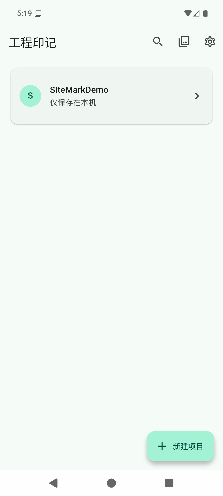
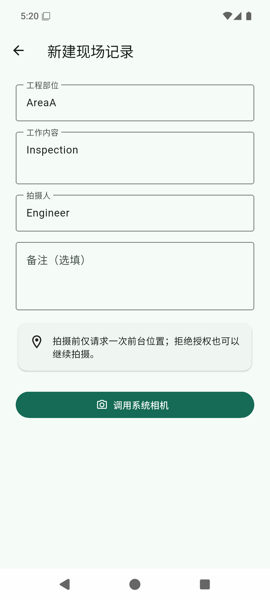
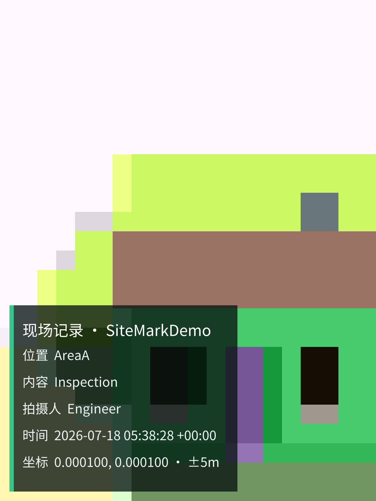

# SiteMark 工程印记

> 调用手机厂商系统相机的开源工程水印相机：无广告、无云端、原图留在本机。

An open-source, offline-first engineering watermark camera that keeps the
manufacturer camera experience.

[](https://github.com/WikG1018/site-mark/actions/workflows/ci.yml)

[](LICENSE)


**当前版本：[`v0.2.0` 签名预发布版](https://github.com/WikG1018/site-mark/releases/tag/v0.2.0)**

支持 Android 12 及以上系统。预发布版适合试用和现场反馈，重要项目请同时保留已导出的备份。

## 下载 / Download

| 安装包 | 适用设备 | 下载 |
| --- | --- | --- |
| arm64 | 推荐；绝大多数近年 Android 手机 | [下载 sitemark-v0.2.0-arm64.apk](https://github.com/WikG1018/site-mark/releases/download/v0.2.0/sitemark-v0.2.0-arm64.apk) |
| universal | 不确定处理器架构或 arm64 无法安装时使用；文件更大 | [下载 sitemark-v0.2.0-universal.apk](https://github.com/WikG1018/site-mark/releases/download/v0.2.0/sitemark-v0.2.0-universal.apk) |
| SHA-256 | 校验下载文件完整性 | [查看 SHA256SUMS.txt](https://github.com/WikG1018/site-mark/releases/download/v0.2.0/SHA256SUMS.txt) |

> **重要数据警告：** 卸载 SiteMark 会删除项目数据库和应用私有原图；已经发布到 `Pictures/SiteMark` 的水印照片通常仍会保留。卸载或切换签名前，必须先导出重要项目和原图。

## 安装与升级

1. 优先下载 arm64 安装包；只有设备不兼容时再使用 universal 通用版。
2. 打开 APK，按 Android 提示允许浏览器或文件管理器“安装未知应用”。
3. 后续使用相同正式签名的新版本时，可以覆盖安装并保留应用数据。
4. 旧 Debug APK 使用不同签名，Android 可能拒绝直接覆盖安装。
5. 遇到签名冲突时，先导出重要数据，再决定是否卸载旧版。
6. [Release 页面](https://github.com/WikG1018/site-mark/releases/tag/v0.2.0)提供版本说明和校验文件。

## 实际效果 / Screenshots

<table>
  <tr>
    <td align="center"><br><sub>项目列表与搜索入口</sub></td>
    <td align="center"><br><sub>现场记录表单</sub></td>
  </tr>
  <tr>
    <td align="center"><br><sub>Android 系统相机</sub></td>
    <td align="center"><br><sub>工程水印成片</sub></td>
  </tr>
</table>

截图来自 Android 16 / API 36 模拟器，使用虚构工程数据。不同厂商的系统相机界面、
镜头能力和成像效果会有所不同。

## 为什么做工程印记 / Why SiteMark

工程现场不仅需要“在照片上加几行字”，还需要顺手的拍摄体验、清晰的项目归档，
以及可以回查照片来源和生成过程的记录链路。

SiteMark 不在应用里重做相机界面，而是通过 Android 标准 Intent 调用手机系统/厂商相机，
保留原有的对焦、HDR、防抖、镜头切换和画质调校。SiteMark 负责拍摄前的工程信息、
拍摄后的本地水印处理和项目导出。

应用没有广告、账号、云端、统计和网络权限。照片、水印和项目数据都在手机本地处理；
原图保存在应用私有目录，完成的水印 JPEG 发布到 `Pictures/SiteMark`。

## 核心能力

| 能力 | 使用说明 |
| --- | --- |
| 系统相机拍摄 | 调用手机系统/厂商相机，保留设备原有的拍摄体验与成像能力 |
| 本地后台处理 | 拍摄后进入 WorkManager 本地队列；上一张处理时可继续拍摄，完成后的状态会自动刷新 |
| 连拍字段保留 | 连拍时保留工程部位、工作内容和拍摄人三项现场信息，仅清空备注 |
| 搜索与筛选 | 首页支持项目搜索；记录可按年、月、日和项目筛选 |
| 浏览与核对 | 提供缩略图、全屏预览、文件大小和原图状态，详情页可查看或删除原图 |
| 批量管理 | 支持批量导出、再次保存、清理原图和全部删除，详情页也可删除整条记录 |
| 外观与默认值 | 支持主题、中英文、新建项目水印默认值和 GitHub 仓库链接 |
| 项目水印设置 | 每个项目可调整字体大小、透明度、位置和强调色 |
| 文件与内部编号 | 文件名包含项目名称和内部编号，水印画面不显示编号 |
| 工程导出 | 项目可导出 ZIP，其中包含 CSV、JSON 和水印成片，并可选择附带原图 |

## 快速使用

1. 新建项目并设置水印。
2. 填写工程部位、工作内容和拍摄人。
3. 选择是否授权前台位置；拒绝后仍可拍照。
4. 调用系统相机完成拍摄。
5. 上一张在后台处理时继续拍摄。
6. 搜索或筛选记录，检查预览、详情、文件大小和原图状态。
7. 批量导出、再次保存、清理原图或删除，也可在详情页单独处理。
8. 卸载或换机前导出重要项目和原图。

## 原图生命周期与删除

- **清理原图**：删除应用私有原图，但保留水印成片、已发布图片、数据库记录和照片编号。
- **全部删除**：删除原图、水印文件、相册已发布图片和数据库记录。

清理和删除前请确认已经完成所需导出；应用私有数据不会因为卸载而自动备份。

## 隐私与权限

| 权限 | 用途 |
| --- | --- |
| `ACCESS_COARSE_LOCATION`、`ACCESS_FINE_LOCATION` | 可选的前台定位；拒绝后仍可拍照 |
| `POST_NOTIFICATIONS` | Android 13+ 后台任务通知支持 |
| `WAKE_LOCK`、`RECEIVE_BOOT_COMPLETED`、`FOREGROUND_SERVICE` | WorkManager 本地后台处理和恢复 |

发布 APK 不申请 `CAMERA`、`INTERNET`、`ACCESS_NETWORK_STATE`、
`ACCESS_BACKGROUND_LOCATION`、广泛媒体访问或传统存储权限。相机由外部系统应用持有，
SiteMark 只通过 Android URI 授权机制临时提供拍摄目标。

点击 GitHub 仓库链接会交给外部浏览器联网，SiteMark 本身仍没有网络权限。

完整说明见 [隐私政策 / Privacy Policy](PRIVACY.md) 和
[安全政策 / Security Policy](SECURITY.md)。

## 水印、文件名与项目导出

水印画面可显示项目名称、工程部位、工作内容、拍摄人、拍摄时间和坐标，
但不会显示照片编号。照片文件名包含项目名称和内部编号，编号仍保存在数据库记录中。

项目导出为 ZIP，可包含：

- 已完成的水印 JPEG；
- 带 UTF-8 BOM 的 CSV，方便在常见表格软件中直接打开；
- 带版本号的 JSON manifest；
- CSV 与 JSON manifest 均保留照片编号；
- 用户明确选择时附带的私有原图。

原图 SHA-256 用于一致性核对和追溯；SiteMark 不提供司法鉴定结论或第三方存证服务。

## 路线图

### P0

- 建立 Xiaomi、OPPO、vivo、Honor、Samsung、Pixel 真机兼容性矩阵，记录 Android 版本、系统相机返回耗时、后台处理结果和已知解决办法。
- 增加完整项目备份与恢复，支持卸载前备份、换机和私有原图/项目数据库恢复。

### P1

- 增加不包含照片内容的本地诊断包，记录设备、系统、应用版本、相机调用耗时和后台任务错误。
- 显示私有存储占用，并支持按项目或日期批量清理原图。
- 将 GitHub 自动发布说明升级为面向用户的版本说明，明确安装包选择、升级风险、已知问题和校验值。

## 验证状态

`v0.2.0` 已完成以下自动化验证：

- 185 项 Flutter 测试通过；
- 20 项 Rust 测试通过；
- `flutter analyze` 无问题；
- Rust 格式检查和 Clippy 通过；
- Android 单元测试通过；
- GitHub Actions 已完成签名 APK 构建。

预发布版仍需要持续补充多品牌真机兼容性反馈。测试安装前请先阅读本页的数据警告，
并在 [Release 页面](https://github.com/WikG1018/site-mark/releases/tag/v0.2.0)查看版本说明和校验文件。

## 技术架构 / Architecture

| 层 | 技术 | 职责 |
| --- | --- | --- |
| 应用与界面 | Flutter、Material 3、Riverpod、GoRouter、Drift/SQLite | 中英文界面、项目/记录状态、本地数据库、连续拍摄字段保留与全局设置 |
| 后台处理 | Kotlin、WorkManager | 串行渲染队列、持久化、重试、开机与进程恢复 |
| Android 集成 | Kotlin、Intent、ContentProvider、LocationManager、MediaStore | 系统相机调用、可选位置和相册发布 |
| 图像与导出 | Rust、flutter_rust_bridge | EXIF 方向、全分辨率水印、SHA-256、CSV/JSON/ZIP 导出 |

详细设计与决策记录：

- [SiteMark v0.1.0 产品与技术设计](docs/superpowers/specs/2026-07-16-sitemark-design.md)
- [SiteMark v0.1.0 实施计划](docs/superpowers/plans/2026-07-16-sitemark-v0.1.0.md)
- [README 产品首页改版设计](docs/superpowers/specs/2026-07-16-readme-redesign-design.md)
- [README 产品首页实施计划](docs/superpowers/plans/2026-07-16-readme-redesign.md)

## 本地构建 / Build locally

已验证的开发环境：Flutter 3.44.6、JDK 17、Android SDK 36、
NDK 28.2.13676358，以及稳定版 Rust（本次验证为 1.95.0）。

```bash
flutter pub get
flutter analyze
flutter test
cargo fmt --manifest-path rust/Cargo.toml -- --check
cargo clippy --manifest-path rust/Cargo.toml -- -D warnings
cargo test --manifest-path rust/Cargo.toml
flutter build apk --debug
```

生产发布需要本地 `android/key.properties` 与对应 keystore；签名文件和密码不会提交到仓库。
完整发布步骤和设备验收项见 [Release checklist](docs/release-checklist.md)。

## 参与贡献

欢迎提交 Android 厂商相机兼容性结果、缺陷复现、隐私审查和工程工作流建议。
开始前请阅读 [Contributing guide](CONTRIBUTING.md)、[Security policy](SECURITY.md)
与 [Third-party notices](THIRD_PARTY_NOTICES.md)。

## License

[Apache License 2.0](LICENSE)
