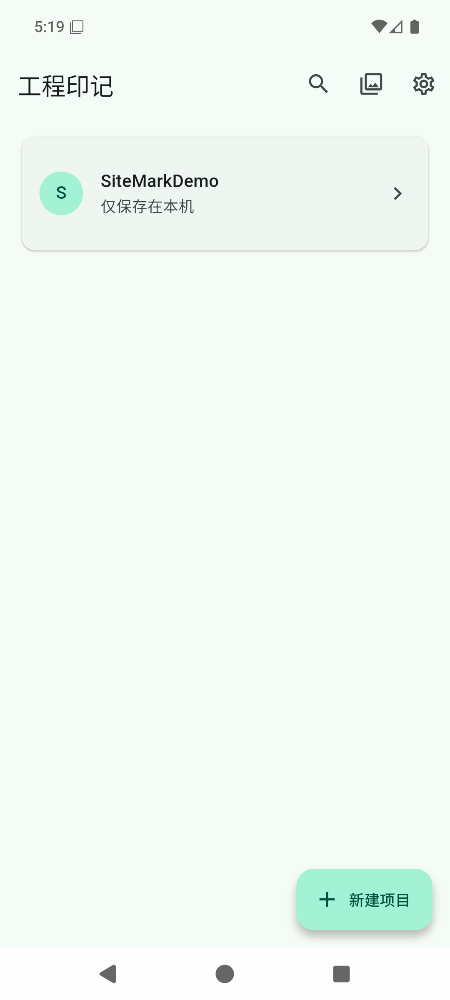
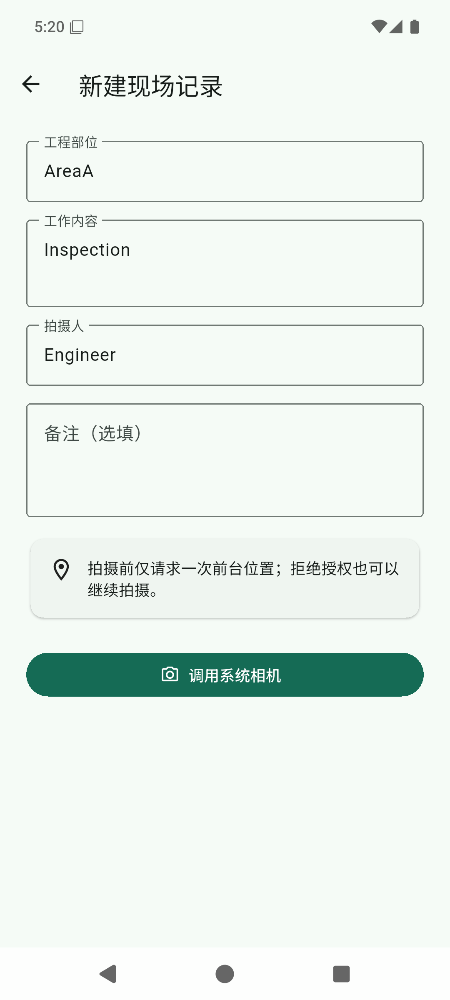
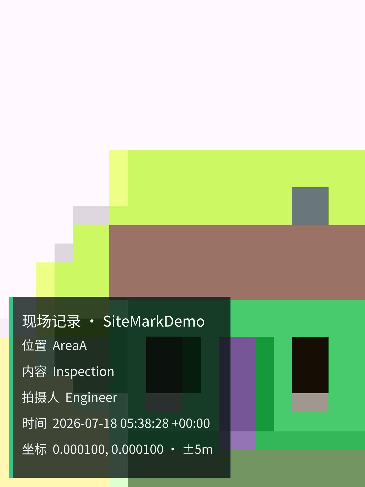

# SiteMark 工程印记

> 面向工程现场记录的 Android 水印相机：调用手机系统/厂商相机，无广告、无账号、无云端，照片与项目数据均在本机处理。

An offline-first engineering watermark camera for Android that keeps the
manufacturer camera experience.

[](https://github.com/WikG1018/site-mark/actions/workflows/ci.yml)

[](LICENSE)


**当前开发候选：v0.10.0+14（未发布）**

**最新发布版本：[`v0.9.0` 预发布版](https://github.com/WikG1018/site-mark/releases/tag/v0.9.0)**

支持 Android 12（API 31）及以上系统。当前仍属于预发布阶段，适合个人工程记录和现场试用；重要项目请定期创建包含私有原图的备份，并把备份文件复制到应用目录之外。

## 下载

| 安装包 | 适用设备 | 下载 |
| --- | --- | --- |
| arm64 | 推荐；绝大多数近年 Android 手机 | [sitemark-v0.9.0-arm64.apk](https://github.com/WikG1018/site-mark/releases/download/v0.9.0/sitemark-v0.9.0-arm64.apk) |
| universal | 不确定处理器架构或 arm64 无法安装时使用；文件更大 | [sitemark-v0.9.0-universal.apk](https://github.com/WikG1018/site-mark/releases/download/v0.9.0/sitemark-v0.9.0-universal.apk) |
| SHA-256 | 校验下载文件是否完整 | [SHA256SUMS.txt](https://github.com/WikG1018/site-mark/releases/download/v0.9.0/SHA256SUMS.txt) |

> [!WARNING]
> 卸载 SiteMark 会删除应用数据库、应用私有原图和私有水印文件。已经发布到系统相册 `Pictures/SiteMark` 的水印照片通常仍会保留。卸载、换机或处理签名冲突前，请先进入“设置 → 备份与恢复”，备份重要项目并把 ZIP 保存到可靠位置。

## 安装与升级

1. 优先下载 arm64 安装包；只有设备不兼容时再使用 universal。
2. 打开 APK，按 Android 提示允许浏览器或文件管理器“安装未知应用”。
3. 正式 Release 使用同一签名，可以直接覆盖升级并保留应用数据。
4. Debug APK 与正式版签名不同，通常不能直接覆盖安装。
5. 如果 Android 提示签名冲突，不要直接卸载保存着重要数据的旧版本；先完成项目备份并确认备份文件已复制到应用目录之外。

## v0.10.0 候选新增内容

- **项目生命周期**：项目分为进行中、已完成、已归档；已完成/已归档禁止新建拍摄，仍可查看、编辑、导出和管理已有记录。
- **置顶与排序**：置顶与生命周期独立；首页按置顶、最近拍摄时间、创建时间、项目 ID 稳定排序。
- **状态筛选与跨状态搜索**：首页默认显示进行中；底部弹层切换状态；搜索覆盖全部状态并显示状态标识。
- **备份保留状态**：单项目 ZIP 升级至 schema v5，精确保留生命周期与置顶；v1–v4 恢复为进行中且未置顶；多项目外层 bundle 仍为 schema v1。

## 从早期版本累计完成的改进

| 范围 | 当前状态 |
| --- | --- |
| 拍摄 | 调用系统/厂商相机，连续拍摄时后台生成水印；支持最近字段建议和项目内命名模板；非进行中项目禁止新拍摄 |
| 记录 | 缩略图预览、详情与全屏查看、文件大小、原图状态、编辑、删除和再次保存 |
| 检索 | 首页状态筛选与跨状态项目搜索；全部记录和项目记录支持关键词搜索及年、月、日筛选 |
| 批量操作 | 多选、按当前筛选结果全选/取消全选、导出、再次保存、清理原图和删除整条记录 |
| 水印 | 项目名称、现场字段、时间和可选位置；支持位置、透明度、字体大小和强调色 |
| 项目 | 生命周期、置顶、同名/安全文件名冲突保护；支持重命名、删除和项目级水印设置 |
| 设置 | 二级菜单、主题/动态颜色、语言、通知、定位、存储、备份恢复、诊断与关于 |
| 数据安全 | 项目备份恢复、原图 SHA-256 校验、恢复事务与文件回滚、异常中断清理 |
| 体验 | 符合层级关系的页面转场、图片 Hero 动画、返回逻辑，以及可继续加载的记录和全屏图片列表 |

## 实际效果

<table>
  <tr>
    <td align="center"><br><sub>项目列表与搜索入口</sub></td>
    <td align="center"><br><sub>现场记录表单</sub></td>
  </tr>
  <tr>
    <td align="center"><br><sub>Android 系统相机</sub></td>
    <td align="center"><br><sub>工程水印成片</sub></td>
  </tr>
</table>

截图使用虚构工程数据。不同厂商系统相机的界面、镜头能力、启动速度和后台限制可能不同。

## 产品定位

工程现场需要的不只是“给照片加文字”，还包括顺手的拍摄体验、稳定的后台处理、清晰的项目归档和可回查的原图信息。

SiteMark 不在应用里重新实现相机，也不嵌入第三方相机 SDK。应用通过 Android 标准能力调用手机系统/厂商相机，保留设备原有的对焦、HDR、防抖、镜头切换和画质调校；SiteMark 负责拍摄前的工程信息、拍摄后的本地水印处理、记录管理和项目备份。

发布 APK 没有广告、账号、云同步或统计上传，也不申请网络权限。点击 GitHub 仓库链接时会交给外部浏览器处理。

## 快速使用

1. 新建项目，按需要填写项目说明并调整“此项目水印设置”。
2. 填写工程部位、工作内容、拍摄人和可选备注；可点选当前项目的最近建议，或应用项目内命名模板。
3. 需要位置时主动请求前台定位；拒绝定位不影响拍照。
4. 点击拍摄，进入手机系统/厂商相机完成拍照。
5. 返回 SiteMark 后照片进入本地后台处理，可继续拍摄下一张。
6. 在项目记录或全部记录中按关键词、项目或日期筛选，预览、编辑和管理照片。
7. 卸载或换机前进入“设置 → 备份与恢复”，选择一个或多个项目创建备份。

连续拍摄会保留工程部位、工作内容和拍摄人，仅清空备注。最近建议来自当前项目的既有记录；命名模板只保存三个必填字段，最多 100 个，备注不会被保存或覆盖。

## 水印与照片命名

水印可显示：

- 项目名称；
- 工程部位；
- 工作内容；
- 拍摄人；
- 拍摄时间；
- 授权并成功获取时的位置。

照片编号不会绘制到水印画面。新照片使用以下短文件名：

```text
{安全化项目名称}-SM-{yyyyMMdd}-{全应用当日序号}.jpg
```

例如：`云湖之城-SM-20260717-003.jpg`。

项目重命名只影响项目显示名称和重命名后的新照片。历史照片编号、文件名、文件路径和已生成水印不会被修改。

## 记录与原图管理

- **清理原图**：删除应用私有原图，保留水印成片、相册照片和数据库记录。
- **删除整条记录**：删除应用内原图、水印文件、数据库记录，并尝试删除该记录发布到系统相册的照片。
- **删除项目**：删除应用内项目、记录和私有文件，但不删除系统相册照片，也不删除已经导出的备份。
- **再次保存**：将水印成片重新发布到 Android 系统相册。

记录详情可查看缩略图、全屏图片、文件大小、原图保留状态、时间、位置和工程字段。项目记录与全部记录均支持编辑模式和批量操作。

## 备份与恢复

入口：**设置 → 备份与恢复**

### 创建备份

- 可选择单个或多个项目；
- 可选择是否包含应用私有原图；
- 空白项目同样可以备份；
- 有照片仍在处理时，应用会阻止备份并提示稍后重试；
- 有处理失败的照片时，默认不会继续，必须明确选择“仅备份已完成记录”；
- 单项目生成可独立恢复的项目 ZIP；多项目生成一个外层 bundle，其中每个项目仍是独立项目 ZIP。

每个项目 ZIP 包含项目元数据、项目水印设置、项目生命周期与置顶、项目内命名模板、已完成的水印 JPEG、UTF-8 BOM CSV 和 JSON manifest；用户选择时还会包含私有原图。项目 ZIP schema v5 继续记录备份快照时间和被明确跳过的失败记录数量，并精确保留生命周期与置顶。多项目外层 bundle 只负责组织这些项目 ZIP，其 schema v1 未改变。

### 恢复

- 项目 ZIP 支持当前 schema v5，以及旧版 v1/v2/v3/v4；这里的兼容版本不指多项目外层 bundle；旧项目 ZIP 恢复后模板列表为空，生命周期为进行中且未置顶；
- 恢复照片编号、拍摄时间、工程字段、位置、水印设置、原图 SHA-256，以及 schema v5 的生命周期与置顶；
- v3 额外恢复项目说明和原始创建时间；
- 恢复前校验归档结构与 SHA-256；schema v5 还严格校验生命周期与置顶字段；
- 恢复过程中项目保持隐藏，项目、记录和模板受同一恢复所有权约束，成功提交后才显示；
- 恢复结果汇总各状态数量；若包含归档项目，可直接跳转到归档列表；
- 恢复失败会回滚数据库内容、暂存文件和已经规划的目标文件；
- 恢复所有权或模板集合内部不一致时，界面统一显示通用恢复失败，不暴露内部状态；
- 应用异常退出后，下次启动会完成已提交的收尾，或回滚未完成的恢复；
- 恢复的照片不会自动写入系统相册，可通过“再次保存”发布。

拍摄记录编辑页生成的普通分享 ZIP 不是项目备份，不能用于恢复。

## 诊断与反馈

入口：**设置 → 诊断与反馈**

诊断功能用于生成便于排查问题的本地 ZIP。当前诊断包包含应用版本、构建号、系统版本、系统语言，以及允许列表内的备份结果、数量和耗时。

隐私边界：

- 诊断记录只保存在本机，不会自动上传；
- 最多保留 7 天，事件文件上限 2 MB；
- 不包含照片、项目名称、项目说明、工程内容、拍摄人、备注；
- 不包含位置坐标、地址、EXIF、照片编号、文件名、文件路径或 SHA-256；
- 不包含原始异常文本和堆栈；
- 当前持久化事件只覆盖备份操作结果，不记录恢复结果；
- 只有用户主动确认后，诊断 ZIP 才会交给 Android 系统分享面板。

## 存储位置与卸载影响

| 数据 | 默认位置/行为 | 卸载后 |
| --- | --- | --- |
| 项目与记录数据库 | 应用私有目录 | 删除 |
| 私有原图 | 应用私有目录 | 删除 |
| 私有水印文件与处理中间文件 | 应用私有目录 | 删除 |
| 水印相册照片 | `Pictures/SiteMark` | 通常保留 |
| 未复制出去的本地导出/备份 ZIP | 应用私有文档目录 | 删除 |
| 已分享或复制到其他位置的备份 | 用户选择的位置 | 不受 SiteMark 卸载影响 |

“设置 → 存储”显示的是 SiteMark 应用内数据库、原图、水印成片、导出文件和其他文档占用，不包含系统相册占用。

## 隐私与权限

| 权限 | 用途 |
| --- | --- |
| `ACCESS_COARSE_LOCATION`、`ACCESS_FINE_LOCATION` | 可选前台定位；仅在用户主动请求时使用，拒绝后仍可拍照 |
| `POST_NOTIFICATIONS` | Android 13+ 后台处理完成通知 |
| `WAKE_LOCK`、`RECEIVE_BOOT_COMPLETED`、`FOREGROUND_SERVICE` | WorkManager 本地后台处理、重试和恢复 |

发布 APK 不申请：

- `CAMERA`；
- `INTERNET`、`ACCESS_NETWORK_STATE`；
- `ACCESS_BACKGROUND_LOCATION`；
- `READ_MEDIA_IMAGES` 或传统广泛存储权限。

相机权限由外部系统相机应用持有，SiteMark 通过临时 URI 授权提供拍摄目标。更多信息见 [隐私政策](PRIVACY.md) 和 [安全政策](SECURITY.md)。

## 当前限制

- 仅支持 Android 12 及以上系统；
- 不提供 iOS 版本、云同步、多人协作或图库图片导入；
- 水印不是自由拖拽模板；
- 后台任务执行时机仍受 Android 和厂商系统调度策略影响；
- SHA-256 用于本地一致性核对，不代表司法鉴定、可信时间戳或第三方存证；
- 不同厂商相机兼容性仍需要更多真实设备反馈。

## 技术架构

| 层 | 技术 | 职责 |
| --- | --- | --- |
| 应用与界面 | Flutter、Material 3、Riverpod、GoRouter | 中英文界面、主题、导航、表单、项目与记录交互 |
| 数据 | Drift、SQLite | 项目、设置、拍摄记录、项目内模板、状态流转、筛选与数据库迁移 |
| 后台任务 | Kotlin、WorkManager、Dart 后台 isolate | 持久化处理队列、失败重试、启动和重启恢复 |
| Android 集成 | Kotlin、Pigeon、Intent、ContentProvider、LocationManager、MediaStore | 系统相机、可选前台定位、图片检查和相册发布 |
| 图像与归档 | Rust、flutter_rust_bridge | EXIF 方向、全分辨率水印、SHA-256、CSV/JSON/ZIP 和备份校验 |

当前维护的产品与技术说明：

- [当前产品边界与总体架构](docs/current-product-architecture.md)
- [拍摄、后台处理与照片存储生命周期](docs/capture-processing-storage.md)
- [项目、记录、水印与设置](docs/record-watermark-settings.md)
- [关键技术决策记录](docs/decision-records.md)
- [发布检查清单](docs/release-checklist.md)

`docs/superpowers/` 保留早期设计、实施计划和审查记录，用于追溯历史，不代表当前版本行为。

## 质量基线

当前版本的发布门禁包括：

- Flutter 单元与 Widget 全量测试；
- Rust 单元与集成测试；
- `flutter analyze`；
- Rust fmt 与 Clippy；
- Android 插件单元测试，以及 Debug/Release APK 构建；
- APK 包名、版本号、minSdk、targetSdk 和禁止权限检查。

正式安装包由版本标签触发 GitHub Actions 完成签名构建。下载和校验请以 [GitHub Release v0.9.0](https://github.com/WikG1018/site-mark/releases/tag/v0.9.0) 中的实际资源为准。

## 本地构建

已验证环境：Flutter 3.44.6、JDK 17、Android SDK 36、NDK 28.2.13676358 和稳定版 Rust。

```bash
flutter pub get
flutter analyze
flutter test
cargo fmt --manifest-path rust/Cargo.toml --check
cargo clippy --manifest-path rust/Cargo.toml --all-targets -- -D warnings
cargo test --manifest-path rust/Cargo.toml
flutter build apk --debug
```

生产发布需要 `android/key.properties` 和对应 keystore。签名文件与密码不会提交到仓库。

## 参与贡献

欢迎提交缺陷复现、Android 厂商相机兼容性结果、隐私审查和工程记录流程建议。开始前请阅读 [贡献指南](CONTRIBUTING.md)、[安全政策](SECURITY.md) 和 [第三方声明](THIRD_PARTY_NOTICES.md)。

## License

[Apache License 2.0](LICENSE)
